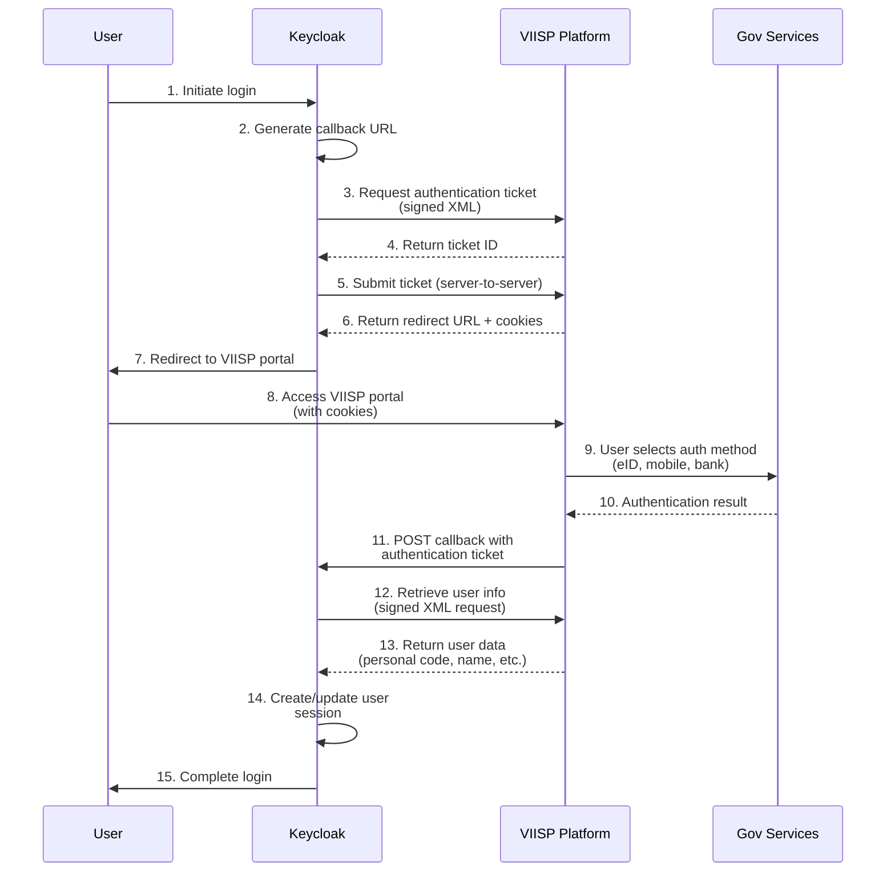

# Keycloak VIISP Identity Provider

A Keycloak extension that integrates with Lithuania's VIISP (Valstybės informacinių išteklių sąveikumo platforma) government authentication platform.

## Overview

This extension provides a custom Identity Provider for Keycloak that enables authentication through Lithuania's eGovernment authentication services. Users can log in using their government-issued digital identities including electronic ID cards, mobile signatures, and internet banking credentials.

## Features

- **Government Authentication**: Integration with VIISP test and production environments
- **Digital Signatures**: XML request signing using RSA-SHA1 with exclusive canonicalization
- **Flexible Configuration**: Support for custom service IDs, keystores, and requested attributes
- **User Attribute Mapping**: Automatic mapping of Lithuanian personal codes, company codes, and personal information
- **Test Environment Support**: Built-in support for VIISP test environment with test certificates

## Implementation Details

### Architecture

The implementation follows Keycloak's Identity Provider SPI (Service Provider Interface) pattern:

- **`ViispIdentityProvider`**: Main provider class handling authentication flow and callback endpoint
- **`ViispIdentityProviderFactory`**: Factory for creating provider instances
- **`ViispIdentityProviderConfig`**: Configuration model for VIISP-specific settings
- **`ViispXMLClient`**: Handles XML generation, signing, and VIISP SOAP communication
- **XML Model Classes**: Jackson XML annotated classes for VIISP XML schema compliance
  - `ViispAuthenticationRequest`: Authentication ticket request model
  - `ViispAuthenticationDataRequest`: User data retrieval request model
  - `ViispAuthenticationProvider`: Enum of supported authentication methods
  - `ViispAuthenticationAttribute`: Enum of authentication attributes (personal codes, etc.)
  - `ViispUserInformation`: Enum of user information fields
  - `ViispUserInfo`: User data model
  - `ViispServiceTarget`: Service target type (citizen, business, etc.)

### Authentication Flow



### Key Components

1. **XML Request Generation**: Creates signed authentication requests using VIISP XML schema with Jackson XML mapper
2. **Digital Signature**: Implements XML digital signatures with RSA-SHA1 and ExcC14N canonicalization
3. **Certificate Management**: Handles X.509 certificates and private keys from Java KeyStore (JKS format)
4. **User Attribute Mapping**: Maps VIISP user data to Keycloak user attributes
5. **SOAP Communication**: Uses Java 11+ HttpClient for SOAP requests to VIISP services
6. **Callback Handler**: POST endpoint that receives authentication tickets and retrieves user data

### Supported Authentication Methods

Through VIISP, users can authenticate using:
- **Electronic ID cards** (eID)
- **Mobile signatures** (Smart-ID, Mobile ID)
- **Internet banking** credentials
- **EU eIDAS** compatible identities

## Configuration

### Required Settings

- **Service ID**: VIISP-assigned service identifier
- **Keystore Path**: Path to Java KeyStore containing certificates
- **Keystore Password**: Password for the keystore
- **Test Mode**: Enable/disable test environment

### Optional Settings

- **Requested Attributes**: Comma-separated list of user attributes to request
- **Custom Callback URL**: Override default callback endpoint

## Build and Deployment

### Prerequisites

- Java 21 or higher
- Maven 3.6+
- Keycloak 26.3.4+ (for deployment)

### Building

```bash
# Set JAVA_HOME to Homebrew OpenJDK
export JAVA_HOME=/opt/homebrew/opt/openjdk

# Build the extension
mvn clean package
```

### Development

```bash
# Install git pre-push hook for the spotless linter and formatter
mvn spotless:install-git-pre-push-hook

# Format code with Spotless (Google Java Format - AOSP style)
mvn spotless:apply

# Check code formatting
mvn spotless:check
```

### Deployment

1. Copy the built JAR to Keycloak providers directory:
   ```bash
   cp target/keycloak-epaslaugos-1.0.0-jar-with-dependencies.jar $KEYCLOAK_HOME/providers/
   ```

2. Restart Keycloak or run build command:
   ```bash
   $KEYCLOAK_HOME/bin/kc.sh build
   ```

3. Configure the VIISP Identity Provider in Keycloak Admin Console

## Testing

The project includes comprehensive test utilities:

- **`TestViispAccess.java`**: Validates connectivity to VIISP test environment
- **`SimpleTestRunner.java`**: Tests core XML client functionality
- **Test certificates**: Included for development and testing

Run tests with:
```bash
JAVA_HOME=/opt/homebrew/opt/openjdk /opt/homebrew/opt/openjdk/bin/java -cp ".:src/main/resources" TestViispAccess
```

## Dependencies

- **Keycloak 26.3.4** (provided scope)
  - keycloak-core
  - keycloak-server-spi
  - keycloak-server-spi-private
  - keycloak-services
- **Jackson Dataformat XML 2.20.0** for XML marshalling/unmarshalling
- **Commons IO 2.3** for file operations
- **Commons Lang 2.6** for utilities
- **Java Cryptography API** for XML digital signatures

## License

MIT License - see [LICENSE](LICENSE) file for details.
